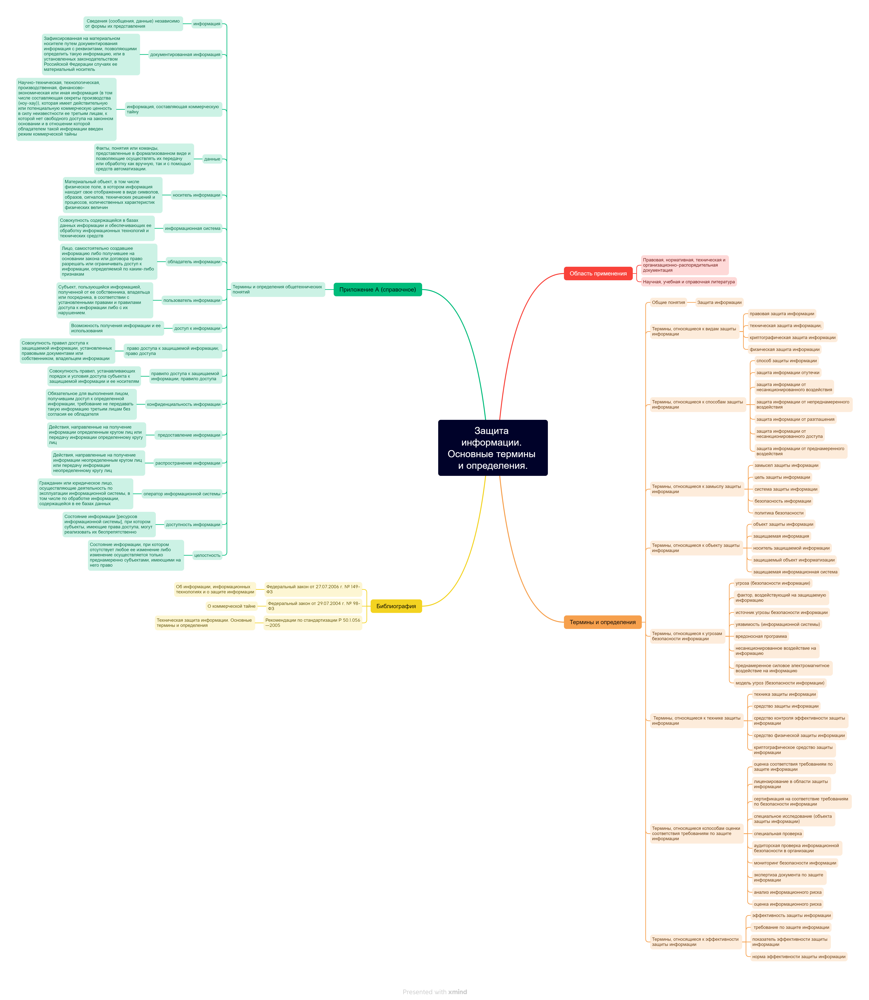

# Изучение ГОСТ
Иван Шаршов

## Цель работы

Изучить ГОСТ по защите информации и познакомиться с построением
mind-карты

## Ход работы

1.  Для построения mind-карты был взят ГОСТ Р 50922-2006. Защита информации. Основные термины и определения. Ссылка на
    документ - https://files.stroyinf.ru/Data2/1/4293836/4293836037.pdf

2.  Была использована программа Freeplane

3.  Результат
    

## Оценка результата

Был изучен ГОСТ Р 50922-2006. Защита информации. Основные термины и определения и была построена mind-карта в программе Freeplane.

## Вывод

Таким образам, был изучен ГОСТ и правила построения mind-карт.
